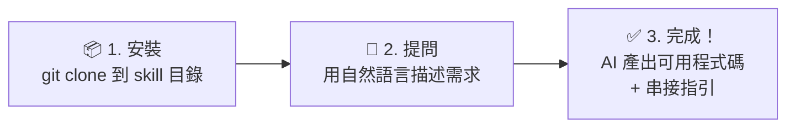

# ezPay 簡單付電子支付 — API Skill
## 前置需求

使用本 Skill 需要以下任一 AI 程式開發助手：

| 平台 | 需求 | 安裝指引 |
|------|------|---------|
| **VS Code Copilot Chat** | VS Code + GitHub Copilot 訂閱 | [vscode_copilot.md](./vscode_copilot.md) |
| **Visual Studio 2026** | Visual Studio 2026 (v18.0+) + GitHub Copilot | [visual_studio_2026.md](./visual_studio_2026.md) |
| Claude Code | Claude 訂閱或 Anthropic Console API 帳號 | [安裝文件](https://code.claude.com/docs/en/overview) |
| GitHub Copilot CLI | GitHub Copilot 訂閱 | [安裝文件](https://docs.github.com/en/copilot/how-tos/copilot-cli/set-up-copilot-cli/install-copilot-cli) |
| Cursor | Cursor 安裝完成 | [下載頁面](https://cursor.com/download) |
| OpenAI Codex CLI | OpenAI 帳號；`npm install -g @openai/codex` | [SETUP.md §CLI](./SETUP.md#cli-安裝openai-codex-cli--google-gemini-cli) |
| Google Gemini CLI | Google 帳號；`npm install -g @google/gemini-cli` | [SETUP.md §CLI](./SETUP.md#cli-安裝openai-codex-cli--google-gemini-cli) |
| ChatGPT GPTs（custom GPT）| 可建立 GPTs 的 ChatGPT 方案 | [GPT Builder](https://chatgpt.com/gpts/editor) |

## 這是什麼？

ezPay API Skill 是一個 **AI 知識套件**——安裝到 AI 程式開發助手（Claude Code、VS Code Copilot Chat、GitHub Copilot CLI、Cursor 等），或透過 ChatGPT **GPT Builder** 等平台上傳後，AI 就能根據你的需求，直接生成簡單付 API 串接程式碼、診斷錯誤、引導完整串接流程。

不需要自己翻文件，用自然語言描述需求即可。

### AI 程式開發助手是什麼？

AI 程式開發助手是安裝在開發者電腦上（終端機或程式碼編輯器內）的 AI 工具，能讀取專案程式碼、用自然語言對話、直接生成或修改程式碼。它不是瀏覽器裡的 ChatGPT——而是嵌入開發工作流程的專業工具。上方「前置需求」表格列出的 Claude Code、VS Code Copilot Chat、GitHub Copilot CLI、Cursor 等都屬於這類工具。

### AI Skill 是什麼？

打個比方：AI 程式開發助手就像一個**聰明但對你的業務一無所知的新進工程師**。AI Skill 就是交給他的「**工作手冊**」——安裝 ezPay API Skill 後，這個 AI 就變成了熟悉簡單付全系列 API 的串接專家。

技術上，AI Skill 是一組 Markdown 文件（入口為 SKILL.md），包含決策樹、整合指南、加密範例和官方 API 索引。AI 偵測到 ezPay 相關關鍵字時會自動啟動，依據這些知識回答問題。

### 💼 給管理決策者

| 常見疑問 | 說明 |
|---------|------|
| **為什麼不直接看官方文件？** | 傳統做法：工程師逐頁翻 API 文件 → 理解規格 → 寫程式 → 除錯來回。安裝本 Skill 後：用中文描述需求 → AI 直接產出可用程式碼 + 串接指引，大幅縮短串接週期 |
| **安全嗎？** | 本 Skill 以 **Markdown 知識檔**為核心，不收集任何資料、不連線至第三方伺服器。密鑰由開發者自行管理，從不寫入 Skill 檔案 |
| **程式碼品質有保障嗎？** | 所有範例基於**簡單付官方 PHP SDK**（134 個驗證範例），API 規格透過 `references/` 即時連結官網最新版本，不依賴過期文件 |
| **需要額外付費嗎？** | 本 Skill 免費提供參考使用（版權所有，詳見 [LICENSE](LICENSE)） |

### 這個 Skill 能做什麼？

| 能力 | 說明 |
|------|------|
| **需求分析** | 根據你的場景（電商、訂閱、門市、直播等）推薦最適合的 ezPay 方案 |
| **程式碼生成** | 基於 134 個驗證過的 PHP 範例，翻譯為 12 種主流語言（或其他語言） |
| **即時除錯** | 診斷 SHA256 失敗、AES 解密錯誤、API 錯誤碼等串接問題 |
| **完整流程** | 引導收款 → 發票 → 出貨的端到端整合 |
| **上線檢查** | 逐項檢查安全性、正確性、合規性 |

## 快速開始

### 核心術語速查

第一次接觸 ezPay？先看這 5 個核心概念（[完整術語表見 guides/00](./guides/00-getting-started.md#新手必知術語10-項速查)）：

| 術語 | 白話解釋 |
|------|---------|
| **MerchantID** | 你的商店編號（由簡單付發給你，金流 / 物流 / 發票各服務帳號不同） |
| **HashKey / HashIV** | 兩把密鑰，加密用的，絕對不能外洩（像你家大門的鑰匙） |
| **SHA256** | 簽名驗證碼——你和簡單付雙方各用密鑰算出簽名，對得上才代表資料沒被竄改 |
| **Callback（ReturnURL）** | 簡單付付款完成後，從**背景**通知你的伺服器的機制（伺服器對伺服器，不是瀏覽器跳轉） |
| **SimulatePaid** | 設為 `1` 就能模擬付款成功，測試時不用真刷卡 |



**三步驟（純文字版）**：① `git clone` 安裝 Skill → ② 用自然語言描述需求（例：「我要信用卡收款」）→ ③ AI 直接產出可用程式碼 + 串接指引

> 💡 安裝後用中文告訴 AI「我要信用卡收款」，它就會產出完整的程式碼和步驟說明。

### 1. 安裝

> **安裝路徑快速對照**（詳細說明見下方各平台段落）：
>
> | 平台 | 安裝指令 | 驗證方式 |
> |------|---------|---------|
> | **VS Code Copilot Chat** | 下載 ZIP → 用 VS Code 開啟資料夾 → 自動載入，見 [vscode_copilot.md](./vscode_copilot.md) | 同上 |
> | **Visual Studio 2026** | Clone 至專案 + 建立 `.github/copilot-instructions.md`，見 [visual_studio_2026.md](./visual_studio_2026.md) | 同上 |
> | Claude Code | `git clone ...ezPay-API-Skill.git ~/.claude/skills/ezpay` | 同上 |
> | GitHub Copilot CLI | Clone 後將 `.github/copilot-instructions.md` 內容貼至目標專案 | 同上 |
> | Cursor | Clone 至專案 + 建立 `AGENTS.md` 引用 | 同上 |
> | ChatGPT GPTs | 上傳 `SKILL_OPENAI.md` 至 GPT Builder Knowledge | 同上 |
> | OpenAI Codex CLI | 讀取 `AGENTS.md`，見 `SETUP.md` | 同上 |
> | Google Gemini CLI | 讀取 `GEMINI.md`，見 `SETUP.md` | 同上 |

**Claude Code**
```bash
# 個人全域安裝（推薦，所有專案共享）
git clone https://github.com/ezPay/ezPay-API-Skill.git ~/.claude/skills/ezpay

# 或專案層級安裝（僅當前專案）
git clone https://github.com/ezPay/ezPay-API-Skill.git .claude/skills/ezpay
```

> 驗證：開啟 Claude Code，輸入 `/ezpay` 或問「What skills are available?」，確認 ezPay API Skill 出現在清單中。

**VS Code Copilot Chat**

> 💡 **最簡單的安裝方式**：下載 ZIP → 解壓縮 → 用 VS Code 開啟資料夾 → 自動載入，不需要終端機操作。
> 完整圖文步驟見 **[vscode_copilot.md](./vscode_copilot.md)**。

**Visual Studio 2026**（C# / .NET 開發者推薦，支援 Agent Mode）

> 💡 Visual Studio 2026 (v18.0+) 和 2022 (v17.14+) 內建 GitHub Copilot，支援 Custom Instructions、Agent Mode、Prompt Files。GitHub Copilot Free 方案即可使用。
> 完整安裝與使用步驟見 **[visual_studio_2026.md](./visual_studio_2026.md)**。

```bash
# Clone 至專案目錄
git clone https://github.com/ezPay/ezPay-API-Skill.git .ezpay-skill

# 建立 Custom Instructions（將 ezPay API Skill 知識載入 Copilot）
# 見 visual_studio_2026.md 中的 copilot-instructions.md 範本
```

安裝後，在 Copilot Chat 中詢問「簡單付 AIO 金流的測試 MerchantID 是多少？」，若回應為 `3002607` 表示 Skill 已載入。

**GitHub Copilot CLI**（終端機工具，適合工程師）

> 💡 **自動載入**：本 repo 的 `.github/copilot-instructions.md` 會被 GitHub Copilot CLI 在此 repo 中工作時**自動讀取**——若你已 clone 本 repo 並在其中開發，Copilot 無需任何額外設定即可感知 ezPay API Skill 知識。
>
> 若要在**其他專案**中使用 ezPay API Skill，需手動將 ezPay API Skill 的指令內容引入你的目標專案：

```bash
# 方式一：Clone 本 repo，再將 .github/copilot-instructions.md 的內容複製到
# 你的目標專案根目錄的 .github/copilot-instructions.md 中（手動貼上，非自動 include）
git clone https://github.com/ezPay/ezPay-API-Skill.git /path/to/ezpay-skill

# 方式二：Clone 到目標專案的子目錄，再手動將 .github/copilot-instructions.md 的
# 完整內容貼至目標專案的 .github/copilot-instructions.md 末尾
git clone https://github.com/ezPay/ezPay-API-Skill.git .github/skills/ezpay
```

> ⚠️ GitHub Copilot CLI 只讀取**專案根目錄**的 `.github/copilot-instructions.md`，不會自動讀取子目錄的 instructions 檔案。因此，clone 到 `.github/skills/ezpay/` 後，需在目標專案的根目錄 `.github/copilot-instructions.md` 中明確引用，Copilot 才能載入 ezPay API Skill 知識。

**Cursor**

> Cursor 使用 `.cursor/rules/` 目錄載入規則，並支援 `AGENTS.md` 自動偵測。

```bash
# 方式一（推薦）：Clone 至專案目錄，Cursor 可透過 AGENTS.md 自動偵測
git clone https://github.com/ezPay/ezPay-API-Skill.git .ezpay-skill
```

Clone 後，在專案根目錄建立或編輯 `AGENTS.md`，加入以下內容：

```markdown
## ezPay API Skill
讀取 `.ezpay-skill/SKILL.md` 作為 ezPay 整合知識庫入口。
完整指南位於 `.ezpay-skill/guides/`（28 份），即時 API 規格索引位於 `.ezpay-skill/references/`。
```

安裝後，在 Cursor 中詢問「簡單付 AIO 金流的測試 MerchantID 是多少？」，若回應為 `3002607` 表示 Skill 已載入。

**ChatGPT GPTs（custom GPT）**

1. 開啟 [GPT Builder](https://chatgpt.com/gpts/editor)，建立新的 GPT
2. 在 Configure → **Knowledge**，上傳 `SKILL_OPENAI.md`（檔案超過 8,000 字元，無法貼入 Instructions）
3. 同樣在 **Knowledge**，上傳 `guides/`、`references/` 等關鍵檔案（最多 20 個）
4. 詳細步驟（含建議上傳的檔案清單）見 [`SETUP.md §ChatGPT`](./SETUP.md#chatgpt-gpts-建置)

**其他框架**：將此資料夾放入框架的 skill 目錄。

### 版本固定（生產環境建議）

生產環境建議固定到特定版本以避免非預期的破壞性變更：

```bash
git clone https://github.com/ezPay/ezPay-API-Skill.git ~/.claude/skills/ezpay
cd ~/.claude/skills/ezpay

# 查看所有可用版本（先確認 tag 名稱，再 checkout）
git tag -l

# 固定至指定版本（以 git tag -l 查到的實際 tag 為準）
git checkout v2.7   # 例如：固定至 V2.7

# 之後如需升級
git fetch --tags
git checkout v2.8   # 升級至新版本（以實際發布 tag 為準）
```

> 💡 **目前可用 tag**：`v1.0`、`v2.5`、`v2.6`、`v2.7`（後續版本隨 release 陸續建立）。開發環境使用 `git pull` 取得最新版即可。

### 驗證安裝

安裝完成後，在 AI 助手中輸入以下測試問題，確認 Skill 正確載入：

> 「簡單付 AIO 金流的測試 MerchantID 是多少？」

若 AI 回應為「`3002607`」，表示 Skill 運作正常。若 AI 回答不確定或僅給出通用建議，請檢查安裝路徑是否正確。

### 2. 使用

安裝後，在 AI 助手中直接用自然語言提問。提到 ezPay 相關關鍵字時 Skill 會自動啟動：

> ezpay, 簡單付, 信用卡串接, 超商取貨, 電子發票, SHA256, 站內付, 金流串接, 物流串接, 定期定額, 綁卡, 退款, 折讓...

**Claude Code 快速指令**（選用）：將 `commands/` 內的 `.md` 檔複製到專案 `.claude/commands/`，即可使用以下 6 個快速指令：

| 指令 | 用途 |
|------|------|
| `/ezpay-pay` | 串接金流（AIO / 站內付 2.0 / 幕後授權）、查詢、退款、Callback |
| `/ezpay-invoice` | 串接電子發票（B2C / B2B / 離線） |
| `/ezpay-logistics` | 串接物流（國內 / 全方位 / 跨境） |
| `/ezpay-ecticket` | 串接電子票證（價金保管 / 純發行） |
| `/ezpay-debug` | 除錯排查 + SHA256/AES 加密驗證 |
| `/ezpay-go-live` | 上線前檢查清單 |

### 3. 使用範例

> 💡 以下範例可**直接複製貼上**給任何 AI 助手使用（含免費模型）。每個 Prompt 已包含完整的測試帳號、環境網址、加密規則與注意事項，無需額外補充即可產出可用程式碼。

**完整 Prompt 範例集（36 個詳盡範例）** → [`docs/prompt-examples.md`](docs/prompt-examples.md)

| 分類 | 範例數 | 涵蓋語言 | 連結 |
|------|--------|---------|------|
| [金流 — AIO 全方位金流](docs/prompt-examples.md#金流--aio-全方位金流) | 7 | Go, Python, TypeScript, Java, C#, Ruby, Kotlin | 信用卡、ATM、超商代碼、分期、定期定額、BNPL、TWQR |
| [金流 — 站內付 2.0](docs/prompt-examples.md#金流--站內付-20) | 4 | Node.js+React, Vue+Express, Swift, Kotlin | 前後端分離、綁卡快速付、iOS/Android App |
| [金流 — 幕後授權 / 查詢 / 退款](docs/prompt-examples.md#金流--幕後授權--查詢--退款) | 4 | Python, Node.js, Go | 幕後取號、訂單查詢、退款、定期定額管理 |
| [電子發票](docs/prompt-examples.md#電子發票) | 4 | Python, Java, C#, Rust | B2C 開立、B2B 開立、折讓、作廢+查詢 |
| [物流](docs/prompt-examples.md#物流) | 4 | C#, Go, TypeScript, PHP | 超商取貨付款、宅配+列印、跨境物流、狀態查詢 |
| [電子票證](docs/prompt-examples.md#電子票證) | 2 | Rust, C++ | 票券發行、核銷+退票 |
| [跨服務整合](docs/prompt-examples.md#跨服務整合) | 2 | Python Django, Node.js | 收款+發票+出貨、訂閱制+自動開發票 |
| [除錯與排查](docs/prompt-examples.md#除錯與排查) | 5 | 通用 | SHA256 失敗、AES 解密亂碼、404 錯誤、Callback 收不到、驗證重試 |
| [上線與環境切換](docs/prompt-examples.md#上線與環境切換) | 1 | 通用 | 測試→正式完整檢查清單 |
| [特殊場景](docs/prompt-examples.md#特殊場景) | 3 | Node.js, Ruby, Swift | POS 刷卡��、直播收款、Apple Pay |


> Version: v1.1-draft
> 基於官方文件：API_E_wallet_ezPay_1.0.2、API_Cross_Trans_ezPay_1.0.1、API_Cross_Trans_refund_ezPay_1.0.3、API_Cross_Trans_search_ezPay_1.0.1、API_Trans_ezPay_1.0.0、BDV_1_0_0

ezPay API Skill 是一組提供給 AI coding assistant 使用的知識文件。安裝到 Claude Code、Copilot、Cursor、OpenClaw 等工具後，AI 能依照 ezPay 官方規格生成串接程式、排查加密錯誤、並引導上線。

## 這份 skill 的定位

- 目標：幫 AI 正確處理 ezPay MPG / Query / Refund / Invoice 串接
- 原則：以官方 PDF 為準，不從第三方 SDK 猜規格
- 加密：**AES-256-CBC + hex + SHA256 `HashKey={key}&{AES_hex}&HashIV={iv}`**
- 傳輸：HTTP POST（`application/x-www-form-urlencoded`），非 JSON

## 基本資訊

| 項目 | 內容 |
|------|------|
| 公司 | 簡單行動支付股份有限公司 |
| 正式環境 | `https://payment.ezpay.com.tw` |
| 測試環境 | `https://cpayment.ezpay.com.tw` |
| API 版本 | MPG 1.0、查詢 1.0、退款 2.1 |
| 主要服務 | 一般交易、跨境交易、交易查詢、退款、電子發票 |

## 涵蓋服務

- 一般交易：`CREDIT` / `P2GEACC` / `ACCLINK` / `WEBATM` / `CVS` / `VACC`
- 跨境交易：`ALIPAY` / `WECHAT`
- 查詢：merchant trade query
- 退款：cross-border refund API
- 電子發票：含 `checkBarCode` 測試流程

## 指南索引

- `guides/00-onboarding.md` — 快速開始
- `guides/01-encryption-deepdive.md` — 加密規格與範例
- `guides/03-express-reference.md` — Express.js 參考實作
- `guides/04-fastapi-reference.md` — FastAPI 參考實作
- `guides/05-webhook-idempotency.md` — webhook 冪等與重送處理
- `guides/06-test-dashboard.md` — 測試/驗證與 dashboard 操作
- `guides/07-prod-readonly.md` — 正式環境只讀檢查
- `guides/10-refund-safety.md` — 退款安全機制

## commands/

最小必要入口：
- `commands/ezpay-pay.md`
- `commands/ezpay-invoice.md`
- `commands/ezpay-debug.md`
- `commands/ezpay-go-live.md`

## test-vectors/

- `test-vectors/aes-encryption.json` — AES + SHA256 驗證向量
- `test-vectors/invoice-barcode.json` — invoice barcode request sample
- `test-vectors/verify-node.js` — Node.js 驗證腳本
- `test-vectors/verify.py` — Python 驗證腳本

## scripts/

- `scripts/validate-internal-links.sh`
- `scripts/validate-version-sync.sh`
- `scripts/validate-vectors-presence.sh`

## 快速命令（給 AI）

- `/ezpay-pay`：產出一般交易串接程式
- `/ezpay-invoice`：產出電子發票 API 請求與測試
- `/ezpay-debug`：排查 AES / SHA256 / 參數錯誤
- `/ezpay-go-live`：上線 checklist

## 核心規則

1. Block size = **32 bytes**（依 ezPay 文件）
2. AES 輸出是 **hex**，不是 base64
3. SHA256 格式必須為 `HashKey={key}&{AES_hex}&HashIV={iv}` 並轉大寫
4. NotifyURL 必須是 public HTTPS
5. webhook 必須可冪等；若文件要求，需立即回 `1|OK`

## 檔案結構

```text
.
├── SKILL.md
├── README.md
├── guides/
├── references/
├── commands/
├── test-vectors/
├── scripts/
├── templates/
├── tools/
└── .github/workflows/ci.yaml
```
