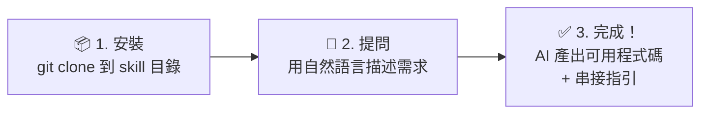

# ezPay 簡單付 — AI API 整合技能

> **專注於 ezPay 簡單付的 AI Skill** — 本 repo 為 ezPay 獨立串接知識庫，與 ECPay / NewebPay 無關。

**當前版本：v1.1**

## 目錄

- [這是什麼？](#這是什麼)
- [前置需求](#前置需求)
- [快速開始](#快速開始)
- [涵蓋服務](#涵蓋服務)
- [特色](#特色)
- [指南索引](#指南索引)
- [目錄結構](#目錄結構)
- [AI 查詢處理流程](#ai-查詢處理流程)
- [測試環境](#測試環境)
- [常見問題](#常見問題)
- [安全政策](#安全政策)

---

## 這是什麼？

ezPay API Skill 是一個 **AI 知識套件**——安裝到 AI 程式開發助手（Claude Code、Cursor、VS Code Copilot、GitHub Copilot CLI 等），AI 就能根據你的需求，直接生成 ezPay 簡單付 API 串接程式碼、診斷加密錯誤、引導完整串接流程。

不需要自己翻文件，用自然語言描述需求即可。

### AI Skill 是什麼？

AI Skill 是一組 Markdown 文件（入口為 `SKILL.md`），包含決策樹、整合指南、加密範例和官方 API 索引。AI 偵測到 ezPay / 簡單付相關關鍵字時會自動啟動。

### 💼 給管理決策者

| 常見疑問 | 說明 |
|---------|------|
| **為什麼不直接看官方文件？** | 傳統做法：工程師逐頁翻 API 文件 → 理解規格 → 寫程式 → 除錯來回。安裝本 Skill 後：用中文描述需求 → AI 直接產出可用程式碼，大幅縮短串接週期 |
| **安全嗎？** | 本 Skill 以 **Markdown 知識檔**為核心，不收集任何資料。密鑰由開發者自行管理，從不寫入 Skill 檔案 |
| **這個 Skill 能做什麼？** | 需求分析、程式碼生成（Express / FastAPI / 其他框架）、即時除錯（AES / SHA256 / 參數錯誤）、Webhook 設計、上線檢查 |

---

## 前置需求

使用本 Skill 需要以下任一 AI 程式開發助手：

| 平台 | 需求 | 安裝方式 |
|------|------|---------|
| **Claude Code** | Claude 訂閱或 API 帳號 | [安裝文件](https://code.claude.com/docs/en/overview) |
| **Cursor** | Cursor 安裝完成 | [下載頁面](https://cursor.com/download) |
| **VS Code Copilot Chat** | VS Code + GitHub Copilot 訂閱 | [vscode_copilot.md](./vscode_copilot.md) |
| **GitHub Copilot CLI** | GitHub Copilot 訂閱 | [安裝文件](https://docs.github.com/en/copilot/how-tos/copilot-cli/set-up-copilot-cli/install-copilot-cli) |
| **OpenAI Codex CLI** | OpenAI 帳號；`npm install -g @openai/codex` | [SETUP.md](./SETUP.md) |
| **Google Gemini CLI** | Google 帳號；`npm install -g @google/gemini-cli` | [SETUP.md](./SETUP.md) |
| **ChatGPT GPTs** | 可建立 GPTs 的 ChatGPT 方案 | [GPT Builder](https://chatgpt.com/gpts/editor) |

---

## 快速開始

### 三步驟



① `git clone` 安裝 Skill → ② 用自然語言描述需求（例：「我要串接 ezPay 信用卡收款」）→ ③ AI 直接產出可用程式碼 + 串接指引

> 💡 安裝後用中文告訴 AI「我要串接 ezPay」，它就會產出完整的程式碼和步驟說明。

### 安裝

**Claude Code**
```bash
# 個人全域安裝（推薦，所有專案共享）
git clone https://github.com/jengwen7-chang/ezpay-payment-skill.git ~/.claude/skills/ezpay-payment-skill

# 或專案層級安裝
git clone https://github.com/jengwen7-chang/ezpay-payment-skill.git .claude/skills/ezpay-payment-skill
```

**Cursor**

Clone 後，在專案根目錄建立或編輯 `AGENTS.md`，加入：

```markdown
## ezPay Payment Skill
讀取 `.ezpay-skill/SKILL.md` 作為 ezPay 整合知識庫入口。
完整指南位於 `.ezpay-skill/guides/`。
```

**GitHub Copilot CLI**

Clone 之後，將 `.github/copilot-instructions.md` 的內容貼到目標專案的 `.github/copilot-instructions.md` 中（手動貼上，非自動 include）。

**ChatGPT GPTs**

1. 開啟 [GPT Builder](https://chatgpt.com/gpts/editor)，建立新的 GPT
2. 在 Configure → **Knowledge**，上傳 `SKILL_OPENAI.md`
3. 在 **Instructions**，貼上 `SKILL_OPENAI.md` 的內容

**OpenAI Codex CLI / Google Gemini CLI**

讀取 `SETUP.md` 中的對應段落。

### 驗證安裝

安裝完成後，在 AI 助手中詢問：

> 「ezPay 測試環境的 Gateway URL 是什麼？」

若 AI 正確回應測試環境資訊（`https://cpayment.ezpay.com.tw`），表示 Skill 已載入。

---

## 涵蓋服務

| 服務 | 內容 | 對應指南 |
|------|------|---------|
| **MPG 付款** | 信用卡一次付清、VACC、WEBATM、CVS | guides/00, 02, 03, 04 |
| **跨境交易** | Alipay、WECHAT Pay | guides/00 |
| **交易查詢** | merchant trade query API | guides/00, 06 |
| **退款** | cross-border refund API（版本 2.1）| guides/10 |
| **Webhook** | 付款通知、回傳驗章、冪等性 | guides/05 |
| **電子發票** | checkBarCode、發票相關流程 | guides/00, 04 |
| **Express / FastAPI** | Node.js / Python 參考實作 | guides/03, 04 |

---

## 特色

- 以 **ezPay 官方文件**（API_E_wallet_ezPay_1.0.2、API_Cross_Trans_ezPay_1.0.1、BDV_1_0_0 等）為唯一事實來源
- **AES-256-CBC + hex + SHA256**：`SHA256(HashKey={key}&{AES_hex}&HashIV={iv})`（大寫）
- block size = **32 bytes**（非 16）
- 支援 Express.js、FastAPI 參考實作
- Webhook 冪等性設計指引
- 退款安全機制
- 電子發票 checkBarCode 測試流程

---

## 指南索引

| # | 檔案 | 主題 |
|---|------|------|
| 00 | guides/00-onboarding.md | 快速開始 |
| 01 | guides/01-encryption-deepdive.md | 加密深度解析（AES-CBC + SHA256）|
| 03 | guides/03-express-reference.md | Express.js 參考實作 |
| 04 | guides/04-fastapi-reference.md | FastAPI 參考實作 |
| 05 | guides/05-webhook-idempotency.md | Webhook 冪等性設計 |
| 06 | guides/06-test-dashboard.md | 測試與驗證儀表板 |
| 07 | guides/07-prod-readonly.md | 正式環境唯讀探針 |
| 10 | guides/10-refund-safety.md | 退款安全機制 |

---

## 目錄結構

```
ezpay-payment-skill/
├── SKILL.md                    # AI 主入口（決策樹 + 導航）
├── SKILL_OPENAI.md             # ChatGPT GPTs Instructions 設定檔
├── SETUP.md                    # 各平台安裝指南
├── README.md                   # 本文件
├── commands/                   # Claude Code 快速指令
│   ├── ezpay-pay.md
│   ├── ezpay-invoice.md
│   ├── ezpay-debug.md
│   └── ezpay-go-live.md
├── guides/                     # 整合指南
├── references/                  # 官方 PDF 文件
│   ├── API_E_wallet_ezPay_1.0.2.pdf
│   ├── API_Cross_Trans_ezPay_1.0.1.pdf
│   ├── API_Cross_Trans_refund_ezPay_1.0.3.pdf
│   ├── BDV_1_0_0.pdf
│   └── README.md
├── test-vectors/               # AES / SHA 測試向量
│   ├── aes-encryption.json
│   ├── invoice-barcode.json
│   ├── verify-node.js
│   └── verify.py
├── scripts/                     # 驗證腳本
└── .github/
    ├── copilot-instructions.md  # Copilot CLI 自動載入
    └── workflows/ci.yaml        # CI 自動化測試
```

---

## AI 查詢處理流程

```
開發者提問 → SKILL.md 決策樹分析需求
  ├── 判斷服務類型（MPG / 跨境 / 發票 / 退款）
  ├── 路由到對應的 guide
  └── 若涉及加密，先確認 AES-CBC + hex + SHA256 規則

guides/XX  →  了解「怎麼做」
  ├── 整合流程與架構邏輯
  ├── 程式碼範例與常見陷阱
  └── 參數表（以官方 PDF 為準）

references/ →  取得「最新規格」
  └── 以 `references/` 中官方 PDF 為準，不依 SDK 猜測
```

> **核心原則**：`guides/` 告訴 AI「怎麼串接」，`references/` 釐清「規格細節」。
> 產生 API 呼叫程式碼前，**必須**以 `references/` 中的官方文件為準。

---

## 測試環境

| 項目 | 值 |
|------|------|
| Gateway | `https://cpayment.ezpay.com.tw` |
| 正式環境 | `https://payment.ezpay.com.tw` |
| MerchantID（範例）| `3629765` |
| HashKey（範例）| `ItCLvnV79uCh88vMPbxwbcf2kxbkglCZ` |
| HashIV（範例）| `OeKkBGrLa33jby51` |
| API 版本 | MPG 1.0、查詢 1.0、退款 2.1 |

正式環境請至 ezPay 後台取得真實金鑰，切勿使用範例金鑰於正式環境。

---

## 常見問題

**Q：加密要用哪個模式？**
A：**AES-256-CBC + hex 輸出**，block size = **32 bytes**，**不是 ECB，也不是 base64**。SHA256 格式為 `HashKey={key}&{AES_hex}&HashIV={iv}` 並轉大寫。詳細說明見 `guides/01-encryption-deepdive.md`。

**Q：電子發票要怎麼測試？**
A：可用 `checkBarCode` API 測試發票 barcode，見 `test-vectors/invoice-barcode.json` 和 `guides/04-fastapi-reference.md`。

**Q：Webhook 收不到怎麼辦？**
A：確認 NotifyURL 為可公開訪問的 HTTPS URL，且正確回應 `1|OK`（盡快回應，不等資料庫寫入）。見 `guides/05-webhook-idempotency.md`。

**Q：測試環境和正式環境差在哪？**
A：主要差異在 Gateway URL、MerchantID、HashKey、HashIV 四項。見 `guides/07-prod-readonly.md`。

**Q：AI 生成的程式碼可以直接使用嗎？**
A：建議人工驗證，特別是金額計算、加密邏輯、Callback 處理等關鍵路徑。搭配 `test-vectors/verify-node.js` 驗證加密向量。

---

## 安全政策

- 密鑰（HashKey / HashIV）**絕不**寫入 Skill 文件或 Git
- Webhook 需具備冪等性（同一筆交易通知可能發送多次）
- 正式環境 NotifyURL 必須是 public HTTPS，不可為 localhost 或內網 IP
- 退款與查詢視為高風險操作，需有額外保護機制
- 漏洞通報請聯繫維護者

---

## 驗證與來源

本 Skill 基於 ezPay 簡單付官方 API 技術文件開發：

- `API_E_wallet_ezPay_1.0.2.pdf` — MPG 一般交易
- `API_Cross_Trans_ezPay_1.0.1.pdf` — 跨境交易（Alipay / WECHAT）
- `API_Cross_Trans_refund_ezPay_1.0.3.pdf` — 退款 API
- `API_Cross_Trans_search_ezPay_1.0.1.pdf` — 交易查詢
- `API_Trans_ezPay_1.0.0.pdf` — 傳統交易
- `BDV_1_0_0.pdf` — 電子發票 barcode

如需驗證內容準確性，請比對以上官方 PDF 文件。
